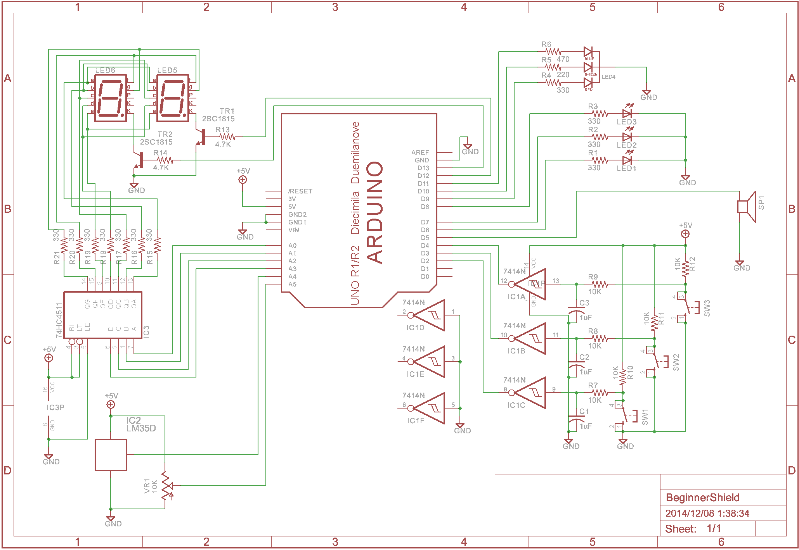

# Beginner Shield

---

## サンプル
BeginnerShieldの学習用サンプルページは下記リンクに飛んでください。
[サンプルページ](https://github.com/ligun/BeginnerShield/tree/master/sample)

BeginnerShieldの説明は下記説明を読んでください。

## 概要
Beginner ShieldはArduino初学者向けのシールド(拡張基板)です。
フィジカルコンピューティングを始めて学ぶ人達がよく使う機能や部品を一つにまとめて効率よく学習することを目的としています。  
初めてフィジカルコンピューティングの世界に入る時、ソフトウェアと同時にハードウェアも扱わなければならず学習コストが高いため負荷が大きいです。少しでも敷居を下げるためにシールドと一緒に各機能の説明、サンプルプログラムを見ることで一つ一つの機能の使い方を学ぶことができるようにしました。

同じようなシールドとしてSparkFunより発売されているDanger Shieldというものがあります。こちらも多数の入出力やセンサーを備えているという点ではBeginner Shieldと同じですが、キットとして販売されているため組み立てが必要です。また、サンプルコードがひとつしかなくシールドや回路図を見てわかる人でないと使うのが難しく一からやる人にとっては少し大変かもしれません。  
そして価格が3000円ほどするため手が出しづらいです。(Arduino本体と同じくらいですね)  
最近ではプログラミングの敷居が下がり、フィジカルコンピューティングを学ぼうという人は多種多様にいます。そこでだれでも手に出しやすい価格でシールドを提供することを目標とします。

## 特徴
### LED、ボタン、センサーなど多数の入出力
フィジカルコンピューティングをやる上で欠かせない入出力部品とセンサーを搭載してます。  
ArduinoのすべてのI/Oピンを使っているため無駄がありません。

### デジタルI/O、ADC、シリアル、PWM、外部割込み等マイコンの基本的な機能を網羅
マイコンの基本的なI/O機能からADCによるセンサー入力読み取り、その他各機能を部品にあわせて全て使えるように配置しています。サンプルプログラムと合わせることで各機能の使い方を説明します。

### 豊富なサンプルプログラム
Beginner Shieldは他のシールドと違いArduinoを拡張して機能を増やすことを目的としていません。はじめから学習のためのものとして機能を定めています。そのため使うための例としてのサンプルではなく、入門書の例題のように一つの機能につき詳細に記述しています。おおまかにLED、7SEG、ボタン、ADCなどの機能がありますが、各機能について2、3回に分けて説明するので10個以上のサンプルを掲載していく予定です。

### 安価なシールド
初心者がよく使う機能のみなのでどこでも手に入る安価な部品のみで構成されています。また最近ではプリント基板を安く製造することができます。そのためにシールド自体も安価に制作することが出来ました。基板自体のデータも公開することで他の人も制作することができ、より安価に入手することが可能になるかもしれません。

## 回路図
Beginner Shieldの回路図は次のようになっています。  
サンプルプログラムではソフトと一緒にハード部分についても説明するため回路図を読めなくても大丈夫です。  
  

## 資料
[部品表](./doc/PartsList.md)  
[ピン接続表](./doc/PinConnect.md)  