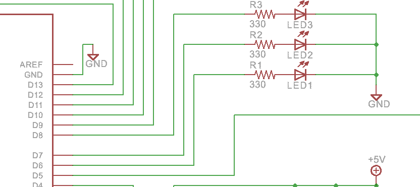
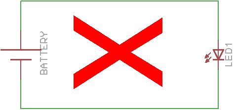
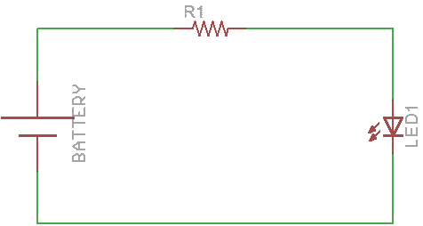

# サンプル01 Lチカ
---

## 概要
Lチカとは読んで字の如くLEDをチカチカさせることです。C言語などソフトウェアで言うHello Worldのようなものです。  
どのマイコンでもまずLEDを点滅させて動作を確認するものです。  
それでは組み込み流の基本をやっていきましょう。  

## 使用回路
Beginner Shieldに搭載されているLEDは赤、黄、緑の単色LEDとフルカラーLED、7SEGLEDがあります。今回はD6につながっている赤色LEDを使います。  
該当部分の回路は次のようになります。  

D6のピンは抵抗R1につながっており抵抗からLED1につながっています。  

## 回路説明
はじめにLEDを点灯させる回路がなぜこのようになっているか説明します。  
まずArduinoのことは一度置いておいて、電源とLEDをつないで点灯する回路を考えます。小学校の頃理科の実験で豆電球と電池をつないで明かりをつけたことがある方は同じようにすればいいのではと思うかもしれませんが、LEDの駆動はそうは行きません。  

なぜならLEDは電圧は降下させるが電流は制限されないからです。  
おっと、言っている意味がわからないですか？これから説明しましょう。  

最低限思い出して欲しいのはオームの法則！  
V = I \* R  
電圧は電流と抵抗の席によっても求まるというあれです。  
先ほどLEDは電流を制限しないと言いました。これは言い換えると抵抗が0(に近い)ということです。  
Arduinoの電圧は5V、抵抗値を0としてオームの法則を元に電流を求めるとI=V/Rで5/0、分母が0になっちゃいます。実際は0に近いのでlim(R->0)5/Rとすると無限大に近い電流になります。もちろん実際には無限大に流れるのは部品耐性的に無理なので素子が壊れてしまいます。  
そこで電流を制限するために必要なのが抵抗です。  
水で例えると、蛇口を開放してものすごい水量がはねているのが抵抗なし、蛇口を閉めてちょうどいいくらいにする動作が抵抗を加えるということです。  
蛇口でも手を洗うのにちょうどいい水量は緩めすぎても締めすぎてもダメですよね？  
電気でも同じことです。それではLEDを駆動するのにちょうどいい抵抗はどのくらいでしょうか？  

LEDのデータシート(仕様)を見ると最大で流せる電流値が書いています。大体20mA程なので今回は余裕を見て10mA流すことにします。  
またLEDは電圧は降下させると言いました。これもデータシートを見ればわかりますが赤色LEDの場合は約2Vです。電源電圧が5Vの時LEDで2V降下するので電流制限抵抗には3Vかかります。  
つまり3Vの電圧を掛けて10mAの電流が流れるようにする。オームの法則より  
R = V /I  
なので  
3 / (10 * 10^-3) = 300Ω  
で求まります。  
今回は330Ωつけています。(300Ωにしないのは大した理由があるわけではなく、手持ちにあるものだったり、私がよく使うものなせいです)  
今回のハードの説明はこんなかんじです。  

## プログラム説明
さて、回路的な説明は終わりましたが、これではただLEDがつき続けるだけですね。今回は電源がつながる代わりにArduinoのピンがつながっています。  
Arduinoのデジタル出力はプログラムで0か1を出力します。これは電気的に言い換えると該当のピンを0Vにするか5Vにするかです。  
回路の説明をちゃんと読んだ方はもうわかりますね。  
LEDをチカチカさせるためには一定時間ごとにD6を0(LOWと言います)と1(HIGHと言います)を切り替えればいいですね。  

初回なのでArduino言語のプログラム(スケッチと言います)を書く手順を説明しまう。  
C言語だとincludeしてmain関数定義してなどありますが、Arduino言語はC言語の最初にやるおまじない的なものは省略されています。  
まず必要なのはsetup関数とloop関数です。  
Arduino IDEを開いて次のように打ってください。  

```C
#define LED_PIN 6

void setup(){

}

void loop(){

}
```

[setup](http://www.musashinodenpa.com/arduino/ref/index.php?f=0&pos=3)関数はArduinoが起動して最初に一度だけ実行されます。ここには初期設定などを記述します。  
[loop](http://www.musashinodenpa.com/arduino/ref/index.php?f=0&pos=25)関数はsetupが実行された後、繰り返し実行されます。ここに動作させたい処理を書きます。  
一番最初のdefineは今回使うLEDのピン番号をわかりやすいようにLED_PINという名前に置き換えています。  

それではsetup関数の中身から書いていきましょう。  
Arduinoはひとつのピンで複数の機能を持っています。そこでまず使うピンにどの機能を割り当てるか指定します。  
今回はD6を出力ピンとして設定したいので[pinMode](http://www.musashinodenpa.com/arduino/ref/index.php?f=0&pos=1987)関数を使い次のように書きます。  

```C
void setup(){
   pinMode(LED_PIN, OUTPUT);
}
```

そしてloopに処理本体を記述します。  
初期状態ではすべてのピンはLOWになっています。ピンの状態を変更するには[digitalWrite](http://www.musashinodenpa.com/arduino/ref/index.php?f=0&pos=2025)関数を使用します。  

```C
void loop(){
   digitalWrite(LED_PIN, HIGH);
}
```

これで6番ピンをHIGHにすることができます。チカチカさせるためにはHIGHにした後LOWに戻さないといけませんが、そのまますぐにLOWにしてしまうとあまりに高速に切り替わるため目視できません。  
そのためある程度待ち時間を置いてあげなければいけません。  
この時に使うのが[delay](http://www.musashinodenpa.com/arduino/ref/index.php?f=0&pos=2564)関数です。  
delay関数の引数として時間をミリ秒単位で渡したげるとその間動作が一時停止します。  
0.5秒おきにチカチカさせたいのなら  

```C
void loop(){
   digitalWrite(LED_PIN, HIGH);
   delay(500);
   digitalWrite(LED_PIN, LOW);
   delay(500);
}
```

という風に書きます。loop関数を一巡するとまたloopの最初から実行されるのでずっとちかちかするようになります。
今回のプログラムを全文で書くと次のようになります。  

```C
#define LED_PIN 6

void setup(){
   pinMode(LED_PIN, OUTPUT);
}

void loop(){
   digitalWrite(LED_PIN, HIGH);
   delay(500);
   digitalWrite(LED_PIN, LOW);
   delay(500);
}
```
これで完成です。今回のサンプルコードとして[Sample01_LChika.ino](Sample01_LChika.ino)を置いているので手っ取り早く確認したい方はこれをIDEで開いて確認して下さい。  

## 実行方法
初回なので書いたスケッチをArduinoにダウンロードして実行する方法を説明します。  